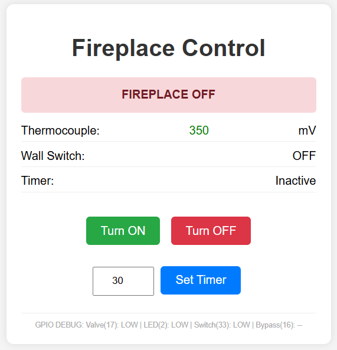

# Smart Fireplace Control (ESP32)

> **⚠️ WARNING: DANGER OF FIRE AND EXPLOSION**
>
> **This project is for EDUCATIONAL PURPOSES ONLY. Do NOT use this in a residential environment.**
>
> Modifying gas appliances and their control systems involves significant risks, including gas leaks, fire, explosion, and carbon monoxide poisoning. This software and hardware design comes with **NO WARRANTY** and the author assumes **NO LIABILITY** for any damage to property, personal injury, or death resulting from its use. **Use entirely at your own risk.**

This project is an ESP32-based smart controller for a gas fireplace. It allows you to control your fireplace remotely via a web interface, set timers, and monitor safety sensors. It is designed to integrate with an existing millivolt gas valve system.



## Features

*   **Web Interface**: Control the fireplace (On/Off) and view status from any browser on your local network.
*   **Timer Function**: Set a countdown timer to automatically turn off the fireplace.
*   **Safety Monitoring**: Monitors a thermocouple voltage to ensure the pilot light is lit and operating within safe parameters before allowing the main valve to open.
*   **Master Bypass**: A physical hardware override switch to force the fireplace on (useful for testing or manual operation).
*   **Wall Switch Integration**: Monitors the state of a physical wall switch (currently used for status reporting).
*   **mDNS Support**: Accessible via `http://fireplace.local` (no need to remember IP addresses).
*   **Static IP**: Configured for a static IP for reliability (default: `192.168.4.52`).

## Hardware Requirements

*   **Microcontroller**: ESP32 Development Board (e.g., NodeMCU-32S).
*   **Thermocouple Interface**: Circuitry to read millivolt signals from the fireplace thermocouple (connected to GPIO 34).
*   **Relay/MOSFET**: To control the main gas valve (connected to GPIO 17).
*   **Switches**:
    *   Wall Switch (GPIO 33)
    *   Master Bypass Switch (GPIO 16)
*   **Power Supply**: 5V USB or external power for the ESP32.

### Pin Configuration

| Component | GPIO Pin | Description |
| :--- | :--- | :--- |
| **Thermocouple** | 34 | Analog Input (ADC1) |
| **Wall Switch** | 33 | Digital Input (Active HIGH) |
| **Valve Output** | 17 | Digital Output (Controls Relay) |
| **Master Bypass** | 16 | Digital Input (Active HIGH) |
| **Onboard LED** | 2 | Status Indicator |

### Hardware Notes

*   **Power & WiFi**: It assumes that you are using a 5V wall charger to power the ESP32 that is usually inside the fireplace. Results with WiFi penetrating the metal/tile box of the fireplace was mixed. It helps if the WiFi router is in the same room. Some ESP32's have an SMA connector that can help if you have the hardware for it.
*   **Relay/Valve Control**: Every fireplace will have a different relay setting with a different DC resistance. You must measure that resistance, and determine what's your best option for powering it. The GPIO's will burn out in the ESP32s. You'll either need a beefy power MOSFET or some other type of sub-relay powered from an external power source.

## Software Requirements

*   **VS Code** with **PlatformIO** extension.
*   **Framework**: Arduino for ESP32.

## Setup & Installation

1.  **Clone the Repository**:
    ```bash
    git clone <repository-url>
    ```

2.  **Configure WiFi Credentials**:
    *   Navigate to the `include/` directory.
    *   Rename `secrets_example.h` to `secrets.h`.
    *   Open `secrets.h` and enter your WiFi SSID and Password:
        ```cpp
        const char* ssid = "YOUR_WIFI_SSID";
        const char* password = "YOUR_WIFI_PASSWORD";
        ```
    *   *Note: `secrets.h` is ignored by git to keep your credentials safe.*

3.  **Network Configuration**:
    *   The project is currently set to use a static IP (`192.168.4.52`).
    *   If your network uses a different subnet (e.g., `192.168.1.x`), update the `local_IP`, `gateway`, and `subnet` variables in `src/main.cpp`.

4.  **Upload**:
    *   Connect your ESP32 to your computer.
    *   Open the project in PlatformIO.
    *   Click the **Upload** button (arrow icon) in the bottom status bar.

## Usage

1.  Power on the device.
2.  Wait for the onboard LED to flash or check the Serial Monitor (115200 baud) for connection status.
3.  Open a web browser and navigate to `http://fireplace.local` or the device's IP address.
4.  **Controls**:
    *   **Turn ON**: Activates the fireplace (checks safety sensors first).
    *   **Turn OFF**: Deactivates the fireplace.
    *   **Set Timer**: Enter minutes and click "Set Timer" to turn on for a specific duration.
5.  **Status Indicators**:
    *   **Green Box**: Fireplace is Active.
    *   **Red Box**: Fireplace is Off.
    *   **Thermocouple**: Shows current voltage (Green = Safe, Red = Unsafe).

## Safety Notes

*   **Thermocouple Safety**: The system will NOT turn on the main valve if the thermocouple reading is outside the safe range (`150mV - 500mV`). This prevents gas flow if the pilot light is out.
*   **Always ensure your gas fireplace is installed and maintained by a professional.** This project is for educational and hobbyist purposes.
